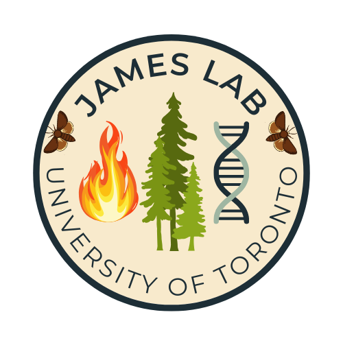

{width="30%"}

**PhD Position in Population Genetics and Outbreak Dynamics**

The James Lab at the Institute of Forestry and Conservation, University
of Toronto, is seeking a motivated, independent, and quantitatively
inclined PhD student to investigate the population genetic dynamics of
cyclic forest insect outbreaks.

Population outbreaks are among the most striking phenomena in ecology,
yet many questions remain regarding how fluctuations in abundance,
dispersal, connectivity, and synchrony influence patterns of genetic
diversity through space and time. The successful candidate will
investigate these relationships using one of the largest spatial and
temporal genomic datasets available for a forest insect, comprising more
than 6,000 spruce budworm (*Choristoneura fumiferana*) individuals
collected across eastern Canada over a 16-year period. The project will
examine how genetic diversity, connectivity, and population structure
change throughout the course of the current outbreak.

The project will also involve developing and applying complementary
demo-genetic simulation models to investigate how population processes
such as dispersal, population growth, bottlenecks, outbreak synchrony,
and local extinction are expected to influence genetic variation under
alternative outbreak scenarios. This project sits at the intersection of
population ecology, population genetics, and simulation, and is well
suited to students interested in combining large genomic datasets with
computational approaches to better understand ecological and
evolutionary processes.

The student will join a collaborative research team that includes
university researchers, federal and provincial government scientists,
postdoctoral fellows, and graduate students working on questions related
to forest ecology, population genetics, insect outbreaks, and
quantitative ecology.

**Applicants should possess:**

-   An MSc degree in ecology, evolutionary biology, forestry, genetics,
    bioinformatics, statistics, computer science, or a related
    discipline

-   Strong quantitative and analytical skills

-   Well developed programming and statistical skills (R, Python)

-   Excellent written and oral communication skills

-   A demonstrated interest in population genetics, evolutionary
    ecology, spatial ecology, or forest disturbances

The following qualifications would be considered assets:

-   Experience with genomic or population genetic data (e.g., RADseq,
    SNP datasets, landscape genetics)

-   Familiarity with Linux, high-performance computing, or
    bioinformatics workflows

-   Experience with multivariate statistics, simulation modelling, or
    spatial analysis (GIS)

Funding is available for four years and includes support for conference
travel, professional development, and collaborative research activities
with university and government partners across Canada. The anticipated
start date is January 2028, although earlier or later start dates may be
considered for exceptional candidates.

To apply, please send:

-   a brief letter describing your research interests and relevant
    experience,

-   your curriculum vitae,

-   unofficial transcripts, and

-   the names and contact information of three academic references

to:

Dr. Patrick James

Institute of Forestry and Conservation University of Toronto

[patrick.james\@utoronto.ca](mailto:patrick.james@utoronto.ca)

*The University of Toronto is strongly committed to diversity within its
community and especially welcomes applications from Indigenous Peoples,
Black and racialized persons, women, persons with disabilities, and
people of diverse sexual and gender identities. All qualified candidates
are encouraged to apply.*
